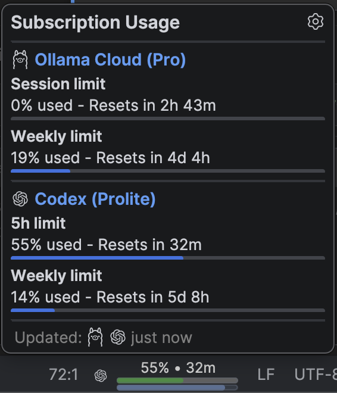
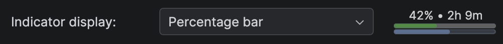
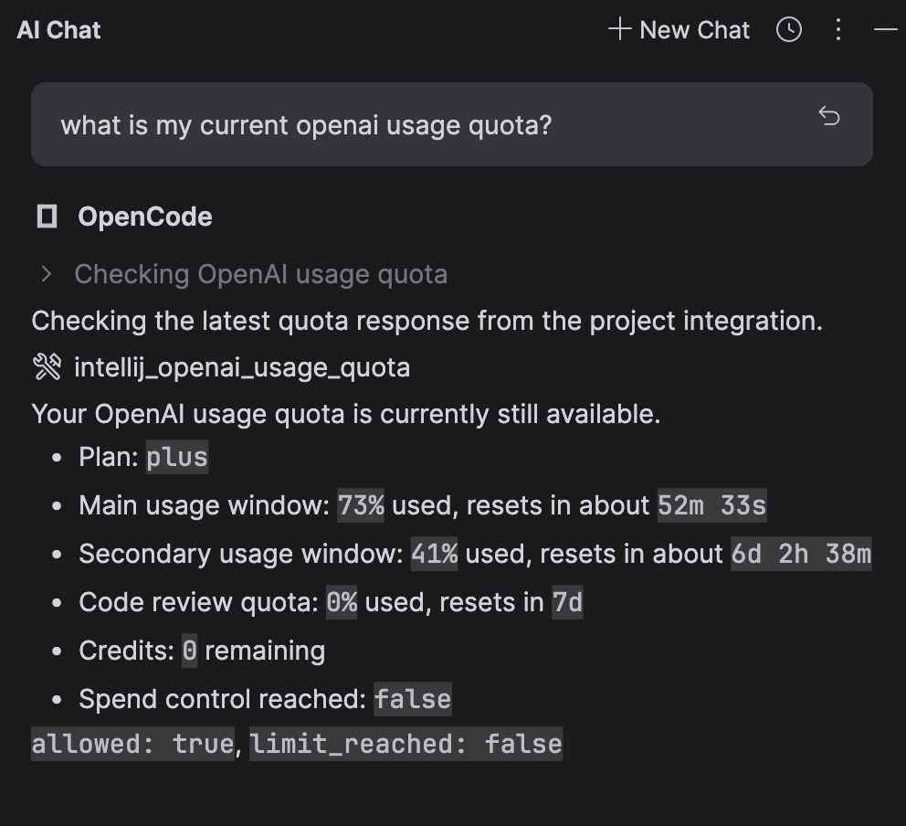
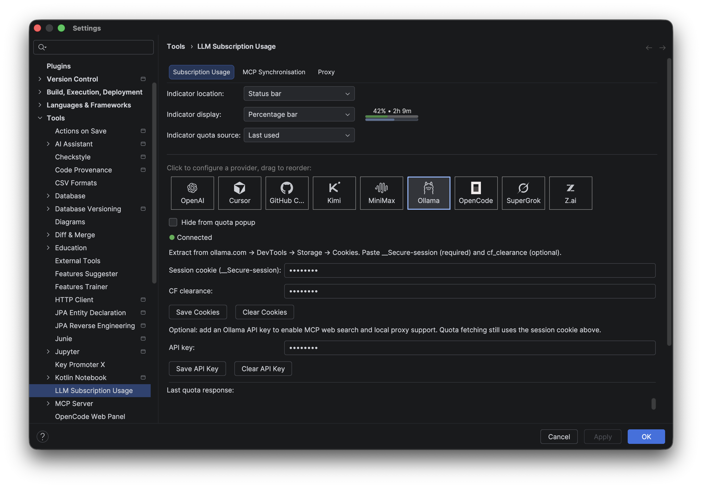

# LLM Subscription Usage

Track your LLM subscription usage quotas directly in IntelliJ IDEA — in the status bar, a detailed popup, and through IDE chat tools.

**Supports:** OpenAI (ChatGPT), OpenCode Go, Ollama Cloud, Z.ai, MiniMax, and Kimi.

<table align="center">
  <tr>
    <td align="center">
      
       
      <strong><a href="https://plugins.jetbrains.com/plugin/30690-openai-usage-quota">LLM Subscription Usage on JetBrains Marketplace</a></strong>
       
      Install the plugin for IntelliJ IDEA.
       
       
      
      
      
    </td>
  </tr>
</table>

---

## Features

**Status Bar Widget** — A compact indicator in your status bar shows at-a-glance quota status. Tooltip reveals quick details; click to open the full popup.

**Quota Popup** — Click the status widget to see:
- All your active subscriptions side-by-side
- Primary and secondary usage windows
- Next reset times
- Last refresh timestamps

**MCP Integration** — Exposes quota data to IntelliJ's built-in chat via the Model Context Protocol, so you can query usage without switching contexts.

**Customizable Display** — Drag-and-drop to reorder providers in the popup. Choose whether the indicator lives in the status bar or main toolbar.

**Automatic Refresh** — Quotas refresh every 5 minutes in the background, plus on login and when opening the popup.

**Secure OAuth** — Login via browser OAuth inside IDE settings. Credentials stored in IntelliJ Password Safe.

---

## Installation

Open IntelliJ IDEA `Settings` > `Plugins` > `Marketplace`, search for **LLM Subscription Usage**, and click Install.

Or download a release ZIP from the [GitHub releases page](https://github.com/moritzfl/openai-usage-quota-intellij/releases) and install from `Settings` > `Plugins` > gear icon > `Install Plugin from Disk...`.

## Getting Started

1. Open `Settings` > `LLM Subscription Usage`
2. Login or add your credentials for your LLM Providers
3. Return to IDE — the status bar widget shows your quota
4. Click the widget for a detailed popup

---

## Screenshots

### Quota Popup

### Status Bar

### Chat (MCP)

### Settings

---

## How It Works

The plugin calls each provider's usage API (with your OAuth token, API Key or other credentials) to fetch quota data, then displays it in a normalized format. Refresh happens automatically in the background every 5 minutes, plus on login and when opening the popup.

Quota data is stored locally in IntelliJ's secure credential storage. Raw responses as they arrived from the API endpoint are available in settings for transparency and debugging.

---

## Troubleshooting

**"Port 1455 is already in use"** — Another process is using the OAuth callback port. Stop it and retry login.

**"Not logged in"** — Open plugin settings and start the login flow again.

**Quota fetch errors** — If backend behavior changed, inspect `Last quota response (JSON)` in settings to see what changed.
