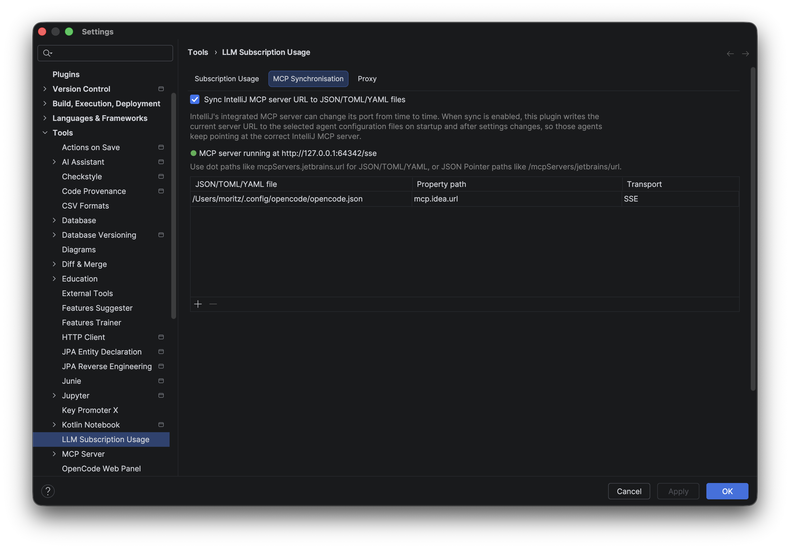
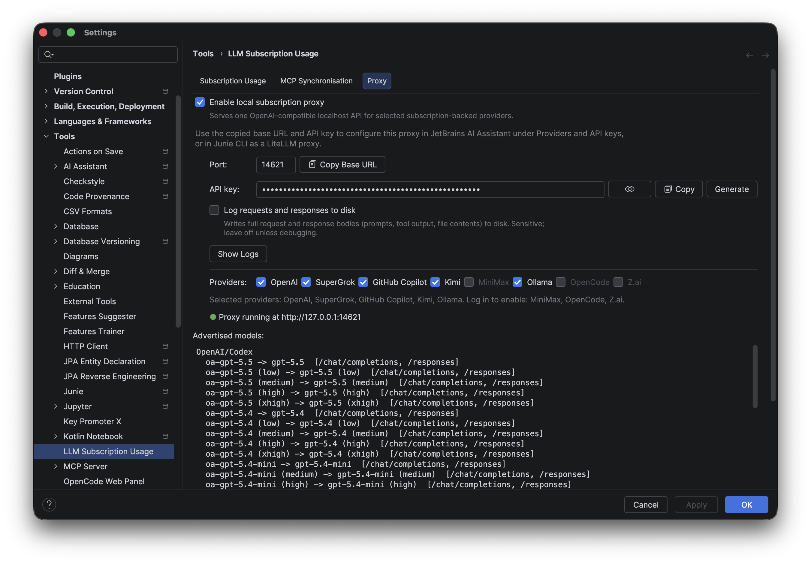

# LLM Subscription Usage

Track and use your LLM subscriptions directly in IntelliJ IDEA — in the status bar, a detailed popup, through IDE chat tools, local AI client MCP configs, and a local OpenAI-compatible proxy.

This plugin started as a simple OpenAI quota checker. It has grown into a multi-provider subscription companion and now includes capabilities beyond quota display, such as hosted web search, image and video generation MCP tools, and a local OpenAI-compatible proxy backed by your subscriptions. The goal is to help you get the most value from the subscriptions you already pay for.

**Supports:** OpenAI (ChatGPT), Claude (Anthropic), SuperGrok/xAI, Cursor, GitHub Copilot, OpenCode Go, Ollama Cloud, Z.ai, MiniMax, and Kimi.

<table align="center">
  <tr>
    <td align="center">
      
       
      <strong><a href="https://plugins.jetbrains.com/plugin/30690-openai-usage-quota">LLM Subscription Usage on JetBrains Marketplace</a></strong>
       
      Install the plugin for IntelliJ IDEA.
       
       
      
      
      
    </td>
  </tr>
</table>

---

## Features

**Status Bar Widget** — A compact indicator in your status bar shows at-a-glance quota status. Tooltip reveals quick details; click to open the full popup.

**Quota Popup** — Click the status widget to see:
- All your active subscriptions side-by-side
- Primary and secondary usage windows
- Next reset times
- Last refresh timestamps

**MCP Integration** — Exposes quota data and supported hosted capabilities to IntelliJ's built-in chat via the Model Context Protocol. It can also sync the currently running IntelliJ MCP server URL into JSON/TOML/YAML config files for local AI clients.

Individual MCP tools can be enabled or disabled in the IDE settings under `Tools` > `MCP Server` > `Exposed Tools`.

**MCP Web Search** — Search the web through subscription-backed provider APIs without leaving the IDE. Supported search providers:
- OpenAI/Codex via the existing OpenAI login
- Kimi via the existing Kimi login
- Z.ai via API key
- MiniMax via API key
- Ollama via API key
- SuperGrok/xAI via the existing SuperGrok login

OpenAI/Codex search supports context-size, live-access, domain-filter, and optional source metadata controls. SuperGrok/xAI search supports model selection and domain filters.

**MCP Image Generation** — Generate images through hosted Codex tooling or SuperGrok/xAI Imagine and optionally save the result directly to a file.

**MCP Video Generation** — Generate videos through SuperGrok/xAI Imagine using the existing SuperGrok login; waits for the finished video by default.

**OpenAI-Compatible Proxy** — Serves a local OpenAI-compatible API backed by your subscriptions (OpenAI/Codex, SuperGrok, GitHub Copilot, Kimi, MiniMax, Ollama, OpenCode Zen, Z.ai), so tools like JetBrains Junie can use it as a custom LLM provider.

**Customizable Display** — Drag-and-drop to reorder providers in the popup. Choose whether the indicator lives in the status bar or main toolbar.

**Automatic Refresh** — Quotas refresh every 5 minutes in the background, plus on login and when opening the popup.

**Secure Credential Storage** — OAuth tokens, API keys, session cookies, and device-flow credentials are stored in IntelliJ Password Safe.

---

## Installation

Open IntelliJ IDEA `Settings` > `Plugins` > `Marketplace`, search for **LLM Subscription Usage**, and click Install.

Or download a release ZIP from the [GitHub releases page](https://github.com/moritzfl/openai-usage-quota-intellij/releases) and install from `Settings` > `Plugins` > gear icon > `Install Plugin from Disk...`.

## Getting Started

1. Open `Settings` > `Tools` > `LLM Subscription Usage`
2. Login or add your credentials for your LLM Providers
3. Return to IDE — the status bar widget shows your quota
4. Click the widget for a detailed popup
5. Optional: enable `Sync IntelliJ MCP server URL to JSON/TOML/YAML files` to keep local AI client MCP configs pointed at IntelliJ's current MCP endpoint

---

## MCP Server URL Sync

The plugin can keep JSON, TOML, and YAML config files up to date with IntelliJ's current MCP server URL. Enable `Sync IntelliJ MCP server URL to JSON/TOML/YAML files` in settings, choose one or more config files, and select an existing string property to update.

This is useful because IntelliJ's MCP server port can change. Tools like OpenCode, Codex, or other local AI clients often store the IntelliJ MCP server URL in their own config files. Server URL sync keeps those configs pointed at the active IntelliJ MCP endpoint automatically, so they continue to connect after the port changes.

The settings page shows whether IntelliJ's MCP server is currently running, installed but stopped, disabled, or unavailable.

---

## OpenAI-Compatible Proxy

When configured, the plugin can run a local proxy that exposes selected subscription-backed providers through standard OpenAI-compatible endpoints (`/v1/chat/completions`, `/v1/responses` where supported, `/v1/models`, plus LiteLLM-style `/v1/model/info`). Any tool that speaks the OpenAI API or expects a LiteLLM server can then use your subscriptions.

To enable it, open the **Proxy** tab in `Settings` > `Tools` > `LLM Subscription Usage`, tick `Enable local subscription proxy`, choose the providers to expose, and apply. The status line shows whether the proxy is off, starting, running, or failed. Use `Copy Base URL` and `Copy API Key` to configure clients; requests authenticate against the locally generated API key, which is stored in the IDE Password Safe.

Notes:

- Configure clients with the base URL **without** a `/v1` suffix (e.g. `http://127.0.0.1:14621`); clients append `/v1/...` themselves, and all routes also answer unprefixed.
- For JetBrains Junie, add the proxy as a LiteLLM provider with that base URL and the copied API key — the available models are then discovered automatically.
- Provider credentials stay in the plugin's regular secure storage. OAuth-backed providers refresh through the existing login flow; API-key-backed providers use the API keys configured in their provider settings.
- `Log requests and responses to disk` writes full request/response bodies to a temp folder for debugging. It is off by default, and logs are pruned automatically (7 days / 2000 files).

The proxy implementation was derived from the initial proxy design of [AIProxyOauth](https://github.com/skanga/AIProxyOauth), adapted to Kotlin and extended for this plugin's multi-provider subscription proxy, broader client compatibility, model discovery, request/response translation, and additional OpenAI-compatible routes.

---

## Screenshots

### Quota Popup

### Status Bar

### Chat (MCP)

### MCP Server URL Sync

### OpenAI-Compatible Proxy

### Settings

---

## How It Works

The plugin calls each provider's usage API (with your OAuth token, API Key or other credentials) to fetch quota data, then displays it in a normalized format. Refresh happens automatically in the background every 5 minutes, plus on login and when opening the popup.

Quota data is stored locally in IntelliJ's secure credential storage. Raw responses as they arrived from the API endpoint are available in settings for transparency and debugging.

---

## Troubleshooting

**"Port 1455 is already in use"** — Another process is using the OAuth callback port. Stop it and retry login.

**"Not logged in"** — Open plugin settings and start the login flow again.

**Quota fetch errors** — If backend behavior changed, inspect `Last quota response (JSON)` in settings to see what changed.
